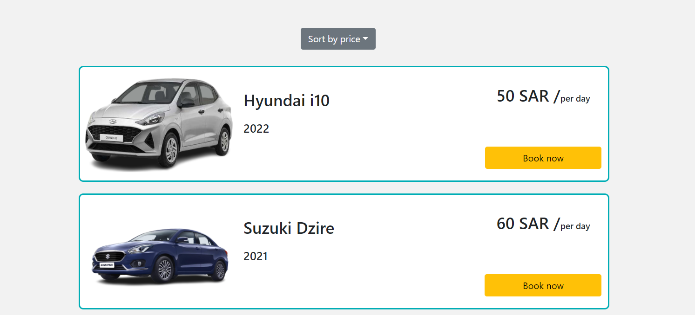

# Cars Rental Website

This project is a car rental website that provides the user with many features such as creating an account on the website, signing in to rent a 
car. The website also includes an admin page which can view the rigistered users and control thier orders.

## Link 
https://cars-rental-app-1iem08g7d-s-mw.vercel.app/

## Top features 
- Create an account (Sign Up)
- Log in to user account (Sign In)
- Search bar
- Pagenation, each page have 10 cars
- Admin page, to control user orders
- Sorting cars by price, from highest to lowest or from lowest to highest 

## Description

This car rental website provide the user with a simple UI that is easy to use. The top of the home page includes only the navigation bar and a 
hero section to give the user a cleane and easy to use UI. Moreover; the Navigation bar includes only the necessary links such as Home, Cart, 
Sign in , Sign up, about us, as well as the search bar.

The hero section has transitionl effects with only 2-3 Images to make the website more appealing to the user. When the user starts scrolling down 
the home page there will be three large box links that includes "Join us" , "Deals" and " Contact Us". These links are intended for maketing 
purposes as they try to tie the user to the website.

  

Further down, the sorting drop down menu show up followed by the cars listing.

Each car card contains information about the car such as "Brand name", "Modle name" and "Renting price" per day. When the user clicks the book 
button he will be directed to the Cart page to chose the "Start" and the "End" dates of the  car rental. 

The cart page also contains the option to apply a coupon and the price will update upon applying the coupon. when the user confirms the order, he 
will be directed to the next page and a summary of his order will be shown with a status "pending". 

The "pending" status will require an action from the admin to either accept or reject the order.   